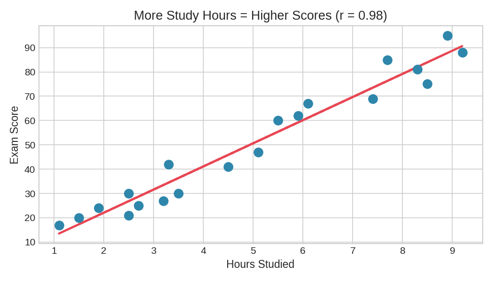
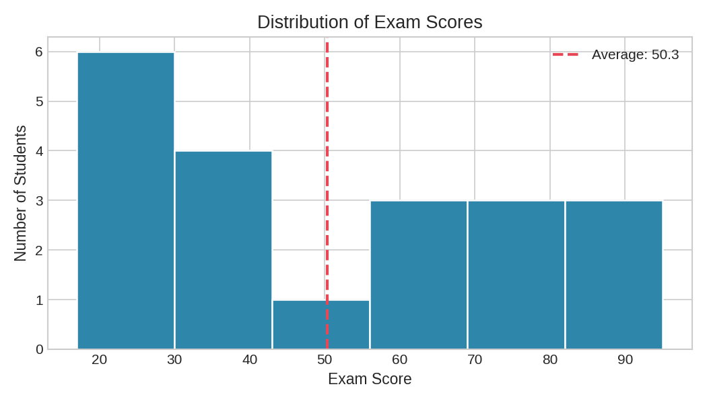

# Student Performance Analysis

Analysed exam scores of 20 students to find what drives academic performance,
using Python on Google Colab.

## Key Findings
- Average score: 50.3/100 — class is underperforming overall
- Only 5 of 20 students (25%) scored above 70
- Correlation between study hours and score = **0.98** (extremely strong)
- Students studying less than 3 hours almost always scored below 30
- Every student who studied 7+ hours scored above 69

## Conclusion
Study time is the single strongest predictor of exam performance.
Increasing average study hours from 5 to 7 would likely push the class average above 70.

## Tools Used
Python · pandas · matplotlib · numpy · Google Colab

## Charts

